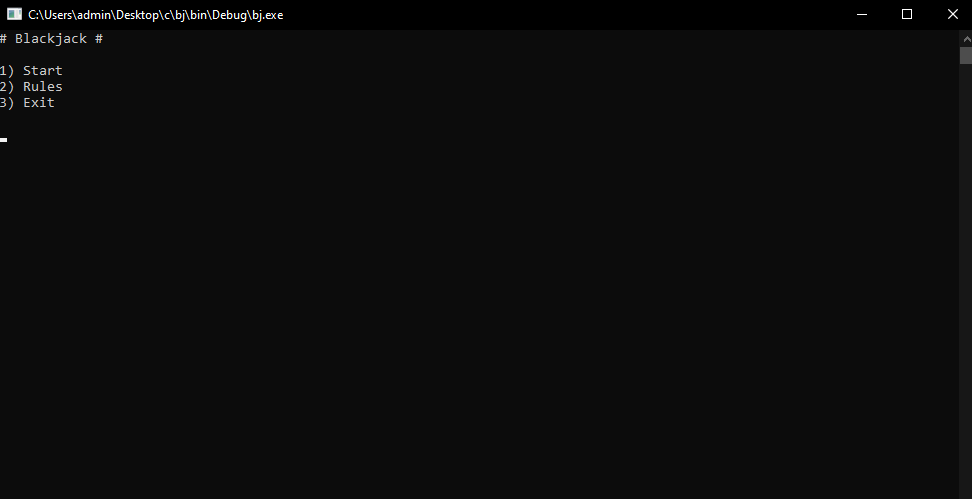
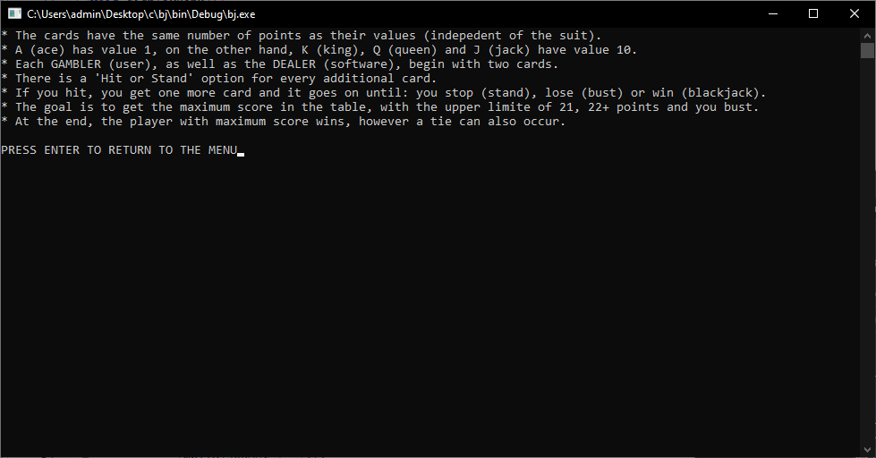

# CBlackJack
A console-based game of BlackJack, player(s) against computer.

This is a project by AM-2001 students Artur Burunov and Egor Bakanach. It is a console-based gaame of Blackjack. The game can be played by up to 7 people, and there will always be an opponent in the face of a computer. The computer always plays with the following rules: hit up to and including 16 and stand if more.

The interface assumes that the user may not be familiar with the rules of the game and suggests that they familiarise themselves with them if necessary.

Game menu

Game rules

Gameplay

